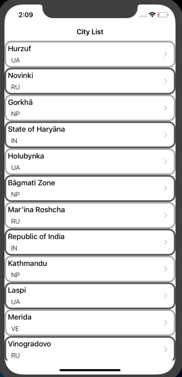

<h1>Swift Weather App(Covr)</h1>

Allows the user to view the current weather by city.  
MVC(Model-View-Controller) architectural pattern was used.

<h2>Externally Used Library</h2>
<a href = "https://openweathermap.org/">OpenWeather</A> returns the current weather data by city id, and private key sent. 
<a href = "https://github.com/vikmeup/SCLAlertView-Swift" >SCLAlertView</a> is a beautiful animated Alert View. 
<a href = "https://github.com/Alamofire/Alamofire">Alamofire</a> fetch data from server as JSON data type. 
<a href = "https://github.com/saoudrizwan/Disk">Disk</a> ensures us to make cache operations easily 

<h2>Screen Gif</h2>

